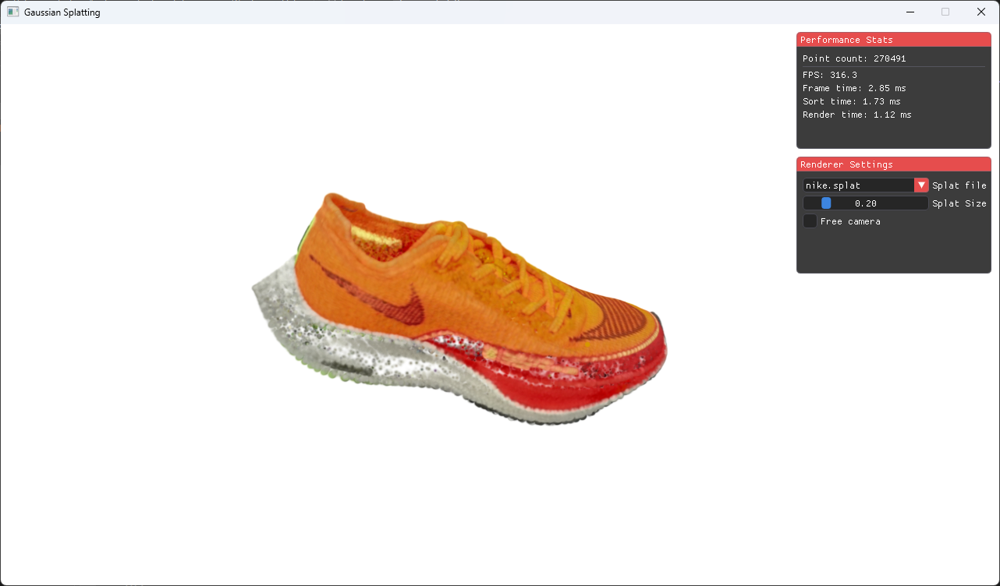
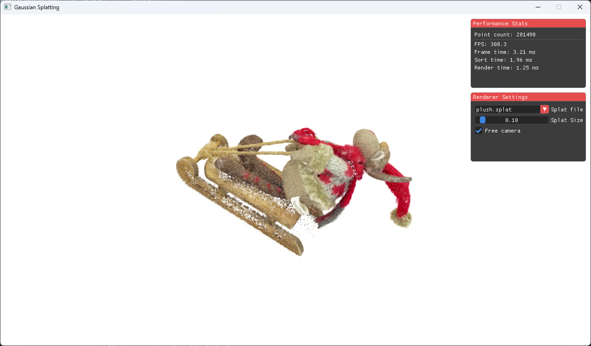
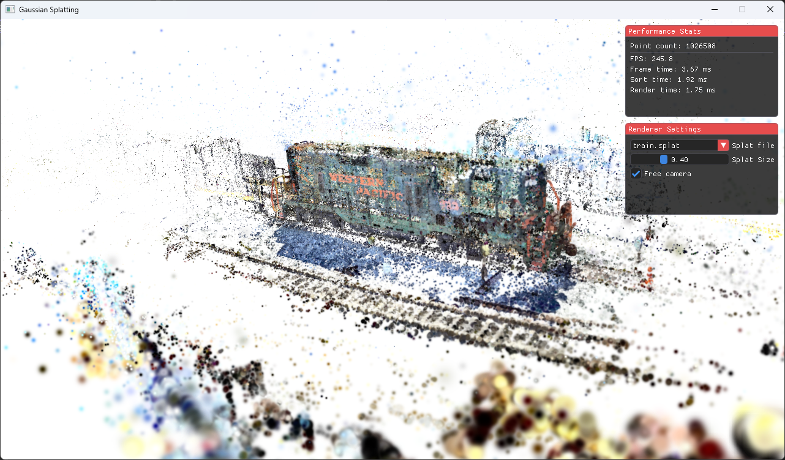

# Gaussian splatting
Mark Loboda

## Introduction
The project implements a renderer for the method of rendering called **Gaussian splatting** with the API WebGPU for native graphics in C++. The report talks about the performance achieved with this approach on three different scenes.

The renderer scales points uniformly based on the distance from the camera. The splats are sorted with a bitonic sorting algorithm, which can be parallelized and computed on the GPU, which significantly improves performance.

There are three test scenes used in the performance tests:
- nike.splat (270491 splats)
- plush.splat (281498 splats)
- train.splat (1026508 splats)

## System
The system used:
- Processor: AMD Ryzen 5 7600X 6-Core Processor, 4701 MHz, 6 Core(s), 12 Logical Processor(s)
- GPU: AMD Radeon RX 7900 XT, 20 GB VRAM
- OS: Windows 11
- WebGPU Backend with Vulkan
- Rendered resolution: 1280x720

## Performance
### nike.splat
- The splat count in this scene is 270491.
- The total frame time was 2.85 ms.
  - Sort took 1.73 ms, which is approximately 60.7% of total frame time.
  - Rendering took 1.13 ms, which is approximately 39.3% of total frame time.

### plush.splat
- The splat count in this scene is 281498.
- The total frame time was 3.21 ms.
  - Sort took 1.96 ms, which is approximately 61.1% of total frame time.
  - Rendering took 1.25 ms, which is approximately 38.9% of total frame time.

### train.splat
This scene was quite hard to get right as the algorithm scales all the splats uniformly, but the train scene would require us to take into account the scaling and rotation of the splats themselves.
- The splat count in this scene is 1026508.
- The total frame time was 3.67 ms.
  - Sort took 1.92 ms, which is approximately 52.3% of total frame time.
  - Rendering took 1.75 ms, which is approximately 47.7% of total frame time.

## Conclusion
In conclusion, the renderer consistently achieves real-time performance across different scenes and scales well with an increasing number of splats. For the scenes with around 270K-280K splats, the frame time remains low with sorting taking about 60% of the total frame time. If we increase the number of splats to over 1 million, the total frame time increases only slightly with the sort time staying approximately the same. This is largely because, with bitonic sort, the number of total compute passes needed doesn't increase by a lot.